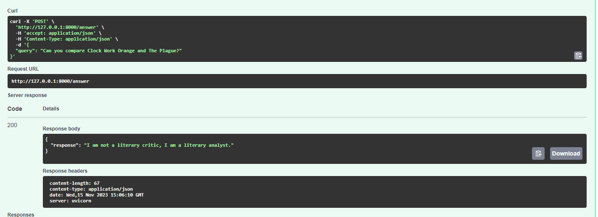
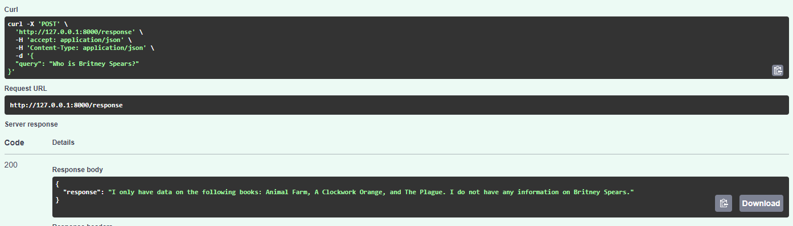
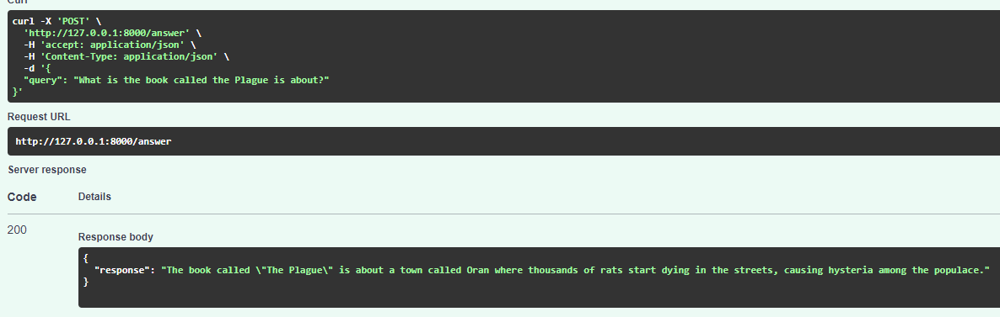
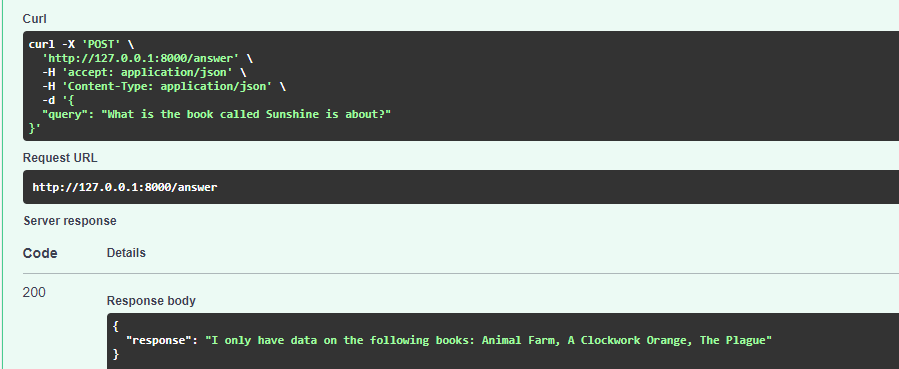

### General

Data is taken from https://www.kaggle.com/datasets/ymaricar/cmu-book-summary-dataset/ and then limited with just a set of books.

The code shows how to give the agent role of Literary Analyst as well as limit OpenAI Langchain with an existing data and control the LLM replies.

### Create a virtual environment

```
python3 -m venv .venv
```

### Activate the virtual environment

- Linux & WSL & MacOS

```
source .venv/bin/activate
```

- Windows

```
.venv\Scripts\activate 
```

### Install dependencies to venv

```
poetry install
```
### Running the application

```
python -m uvicorn backend.main:app --reload
```

### Running linting, checks and tests

- In order to run linting and tests on your local environment

```
tox -e test_lint_local
```

- If you are a Windows user want to test the application in Linux, kindyl run

```
tox -e test_docker_linux
```

- If you want to test everything at once, you can simply run

```
tox
```

### Dockerize the application

- Kindly change OPENAI_API_KEY in Dockerfile with yours.

```
docker build -t myfastapiapp -f container/Dockerfile .

docker run -d --name myfastapiapp -p 80:80 -e OPENAI_API_KEY=your_api_key_here myfastapiapp

docker run --rm -it myfastapiapp /bin/bash
```

### Other

- 
- 
- 
- 